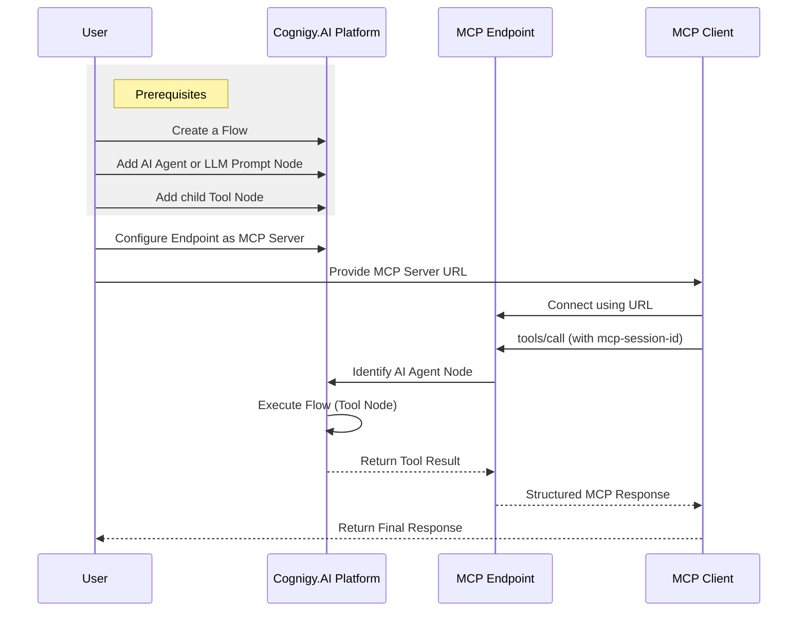

<a href="/release-notes/2026.5"><Badge className="version-badge" color="purple">Added in 2026.6 (experimental)</Badge></a>

<Frame>
  
</Frame>

<Warning>
 The MCP Server Endpoint is experimental and isn't recommended for production use. This Endpoint may change or be removed in future releases. Use it only in development or staging environments.
</Warning>

The MCP Server Endpoint allows external AI applications to use tools from an AI Agent in Cognigy.AI via the Model Context Protocol (MCP). Compatible clients, such as desktop AI assistants or custom MCP applications, can discover and execute these tools.

Unlike standard Endpoints, the MCP Server Endpoint isn't designed for conversational use. It doesn't use NLU, process user messages, or perform real-time translation. Instead, it works as a tool server: clients discover the available tools and invoke them using structured requests. Cognigy.AI then executes the corresponding Flow logic and returns the results through the MCP protocol.

## Key Benefits

- **Tool Access through MCP**. Tools configured under an [AI Agent](/ai/agents/overview) or [LLM Prompt](/ai/agents/develop/node-reference/service/llm-prompt) Node are available to MCP-compatible clients.
- **Direct Flow Execution**. When a tool is called, Cognigy.AI executes the related Flow and returns the result through MCP.
- **Standard Integration**. MCP provides a consistent interface for connecting external applications without custom APIs.

## Restrictions

- The following tools are available via MCP:
   - Regular Tool
   - Knowledge Search
   - Send Email
   - Execute Workflow
   - Handover to AI Agent
- Tool calls must finish within the configured timeout. The default timeout is 30 seconds. If you have an on-premises installation, you can change the default value via the `MCP_SERVER_TOOL_CALL_TIMEOUT` variable.
- This Endpoint doesn't support OAuth or user-level authentication.

## Prerequisites


- A Flow that contains either an AI Agent or LLM Prompt Node.
- The AI Agent Node or LLM Prompt Node in the Flow must include at least one Tool Node.
  - Each Tool Node has a tool ID and a description.

## Generic Endpoint Settings

- [Advanced: Mocking](/ai/agents/test/mocking)
- [Data Protection & Analytics](/ai/agents/deploy/endpoints/data-protection-and-analytics)
- [Transformer Functions](/ai/for-developers/transformers/overview)

## Specific Endpoint Settings

<AccordionGroup>

  <Accordion title="MCP Explorer">
    | **Parameter** | **Description** |
    |---------------|-----------------|
    | MCP Explorer | A link to test your tools and view connection details. It displays all exposed tools, including their names, descriptions, and parameters, and allows validation and testing of the configuration. |
  </Accordion>

  <Accordion title="AI Agent Selection">
    This section allows you to select the Flow and AI Agent Node that will expose its tools via the Model Context Protocol (MCP). External AI clients can discover and call these tools through this endpoint. |

    | **Parameter** | **Description** |
    |---------------|-----------------|
    | Flow | The Flow that contains the selected AI Agent Node. |
    | Node | The AI Agent or LLM Prompt Node whose child Tool Nodes are exposed via MCP. Only tools defined as children of the selected Node are exposed to MCP clients. |
    | Exposed Tools | Displays all exposed tools. |
  </Accordion>

  <Accordion title="Configuration Information">
    This section provides the MCP Server URL and a list of all exposed tools, including their names, descriptions, and parameters. This information is required to configure MCP clients. |

    | **Parameter** | **Description** |
    |---------------|-----------------|
    | MCP Server URL | The dedicated MCP URL in the format `https://endpoint.cognigy.ai/mcp/v1/{token}/mcp`. This is the single entry point for all MCP traffic and must be kept confidential. |
    | Enable MCP Server | Activates the MCP Server functionality for the Endpoint. |
  </Accordion>

</AccordionGroup>

## How to Set Up

The diagram shows the complete MCP workflow. First, make sure your Flow is set up correctly with an AI Agent Node and a Tool Node, according to the prerequisites. Then, the MCP client connects to the MCP Server Endpoint and calls a tool. This triggers the Flow execution. The result is returned through a session-based connection.



### Setup on the Cognigy.AI Side

<Accordion title="Configure an MCP Server Endpoint">
   1. In the left-side menu of your Project, click **Deploy > Endpoints**.
   2. On the **Endpoints** page, click **+ New Endpoint**.
   3. In the **New Endpoint** section, do the following:
       1. Select the **MCP Server** Endpoint type.
       2. Specify a unique name.
       3. Save changes.
   4. In **AI Agent Selection**, select the Flow and the AI Agent Node or LLM Prompt whose tools you want to expose via MCP. Save changes.
   5. In the **Configuration Information** section, copy the URL in the **MCP Server URL** field.
</Accordion>

### Setup on the Third-Party Provider Side

<Accordion title="Configure an MCP Client">

  The configuration depends on the MCP client you use.

<Tabs>
  <Tab title="Direct HTTP Integration">
   The MCP Server Endpoint supports the MCP Streamable HTTP transport. To integrate directly with the Endpoint, follow these steps:

   1. Send an `initialize` request.

       ```bash
       curl -i -X POST https://endpoint-dev.cognigy.ai/mcp/v1/{token}/mcp \
         -H "Content-Type: application/json" \
         -d '{
           "jsonrpc": "2.0",
           "id": 1,
           "method": "initialize",
           "params": {
             "protocolVersion": "2024-11-05",
             "capabilities": {},
             "clientInfo": {
               "name": "test",
               "version": "1.0"
             }
           }
         }'
       ```
       Replace `{token}` with the token from the MCP Server URL.

   2. The response will include `mcp-session-id: <session-id>`. Store the session ID for use in subsequent requests.
   3. Request a list of available tools via `tools/list`:

       ```bash
       curl -X POST https://endpoint-dev.cognigy.ai/mcp/v1/{token}/mcp \
         -H "Content-Type: application/json" \
         -H "mcp-session-id: <session-id>" \
         -d '{
           "jsonrpc": "2.0",
           "id": 2,
           "method": "tools/list"
         }'
        ```

      The request returns the list of available tools with their parameters and descriptions. This allows the client to understand how to call each tool correctly.

      For example, the response may include tools like this:

      ```json
      {
        "jsonrpc": "2.0",
        "id": 2,
        "result": {
          "tools": [
            {
              "name": "mcp",
              "description": "",
              "inputSchema": {
                "type": "object",
                "properties": {},
                "required": []
              }
            },
            {
              "name": "SearchCognigyDocumentation",
              "description": "",
              "inputSchema": {
                "type": "object",
                "properties": {},
                "required": []
              }
            },
            {
              "name": "unlock_account",
              "description": "This tool unlocks a locked user account.",
              "inputSchema": {
                "type": "object",
                "properties": {
                  "email": {
                    "type": "string",
                    "description": "User's login email for their account."
                  }
                },
                "required": ["email"]
              }
            }
          ]
        }
      }
      ```

    4. Call tools using the `tools/call` method, providing the tool name and required arguments.
       For example, to call the `unlock_account` tool with the required `email` argument, send the following request:

         ```bash
         curl -X POST https://endpoint-dev.cognigy.ai/mcp/v1/{token}/mcp \
           -H "Content-Type: application/json" \
           -H "mcp-session-id: <session_id>" \
           -d '{
             "jsonrpc": "2.0",
             "id": 2,
             "method": "tools/call",
             "params": {
               "name": "unlock_account",
               "arguments": {
                 "email": "user@example.com"
               }
             }
           }'
          ```

         After a successful tool call, the MCP server returns the result in a structured MCP response. The response contains the output of the executed tool inside the result field. For example, if the tool completes successfully, it may return a text message such as `Resolved` in the content array.

         ```json
         {
           "jsonrpc": "2.0",
           "id": 2,
           "result": {
             "content": [
               {
                 "type": "text",
                 "text": "Resolved"
               }
             ]
           }
         }
         ```
    </Tab>
     <Tab title="Claude Desktop">
      To configure the MCP client in Claude Desktop, follow these steps:

      1. In the Claude Desktop application, go to **Settings > Developer > Local MCP servers**. Click **Edit Config**.
      2. Add the following configuration to `claude_desktop_config.json`:

        ```json
        {
          "mcpServers": {
            "cognigy-agent": {
              "command": "npx",
              "args": [
                "mcp-remote",
                "https://endpoint.cognigy.ai/mcp/v1/{token}/mcp"
              ]
            }
          }
        }
        ```

         Replace `{token}` with the token from the MCP Server URL.

      3. Close and reopen Claude Desktop. It automatically launches `mcp-remote`, connects to the MCP server, initializes the session, and loads the available tools.
      4. In Claude Desktop, open the chat and ask the AI to perform a task that requires a tool. Claude Desktop will automatically call the appropriate MCP tool when needed.

      </Tab>
      <Tab title="Cursor">
        To configure the MCP client in Cursor, follow these steps:

        1. In the root directory of your Cursor project, create the `.cursor/mcp.json` file. If the `.cursor` folder doesn't exist, create it manually.
        2. Add the following configuration to the `mcp.json` file:

            ```json
            {
              "mcpServers": {
                "cognigy-mcp": {
                  "command": "npx",
                  "args": [
                    "-y",
                    "mcp-remote",
                    "https://endpoint.cognigy.ai/mcp/v1/{token}/mcp"
                  ]
                }
              }
            }
            ```
            The `-y` flag ensures `npx` runs the package without prompting for confirmation. Replace `{token}` with the token from the MCP Server URL.

        3. Close and reopen Cursor. It automatically launches `mcp-remote`, connects to the MCP server, initializes the session, and loads the available tools.
        4. Open the Cursor Chat in Agent mode. Ask the AI to perform a task that requires a tool. Cursor will automatically call the appropriate MCP tool when needed.
      </Tab>
  </Tabs>
</Accordion>

## Use Cases

<AccordionGroup>
  <Accordion title="Access Knowledge Bases">
    External AI clients can use MCP to query Cognigy knowledge bases through the Knowledge Search Tool.
    This approach enables real-time retrieval of relevant content, such as product information, policies, or support articles,
    directly from connected applications.
  </Accordion>

  <Accordion title="Automate Business Tasks">
    MCP clients can trigger operational workflows, such as CRM lookups, ticket creation, or email notifications.
    When a tool is called, the corresponding Flow is executed, allowing existing business logic to run
    without modification.
  </Accordion>

  <Accordion title="Expose Internal Logic">
    Existing Flows can be published as callable tools. This approach allows organizations to reuse and expose
    internal automation, decision logic, and AI Agent configurations as standardized tools
    available to external systems.
  </Accordion>

  <Accordion title="Connect Custom Applications">
    Custom AI applications, development environments, or third-party systems can integrate with Cognigy.AI
    through the MCP protocol. This approach enables structured tool calls and consistent result handling
    without building and maintaining custom APIs.
  </Accordion>
</AccordionGroup>

## Troubleshooting

| **Issue**           | **Cause**                                                                                                                             | **Solution**                                                                                                                                                                        |
| ------------------- | ------------------------------------------------------------------------------------------------------------------------------------- | ----------------------------------------------------------------------------------------------------------------------------------------------------------------------------------- |
| Tools Not Visible   | The AI Agent Node doesn't contain tool Nodes, or tools are missing a tool ID or description. The wrong Flow or Node may be selected. | Ensure the AI Agent Node includes Tool Nodes. Verify that each tool has a tool ID and description. Confirm the correct Flow and Node are selected in the Endpoint settings. |
| Tool Call Times Out | The tool execution exceeds the default 30-second timeout.                                                                          | If you have an on-premises installation, adjust the `MCP_SERVER_TOOL_CALL_TIMEOUT` configuration if a longer execution time is required.                                                                                     |
| Connection Fails    | The full MCP URL isn't specified, or an incorrect path is configured.                                                                     | Ensure you are using the complete URL in the format `/mcp/v1/{token}/mcp`. The Endpoint doesn't respond on other paths.                                                            |
| Session Expired     | The MCP session has timed out due to inactivity.                                                                                      | Reinitialize the session by sending a new `initialize` request without a session ID.                                                                                                |
| The **Run Test** Button in the MCP Explorer isn't Active | Strict CSP headers block required page scripts on the MCP Explorer page.                            | Content Security Policy is managed at the platform or deployment level and can't be configured at the Endpoint level.  Contact your platform administrator or support team to allow the required scripts for the MCP Server Endpoint route. |
