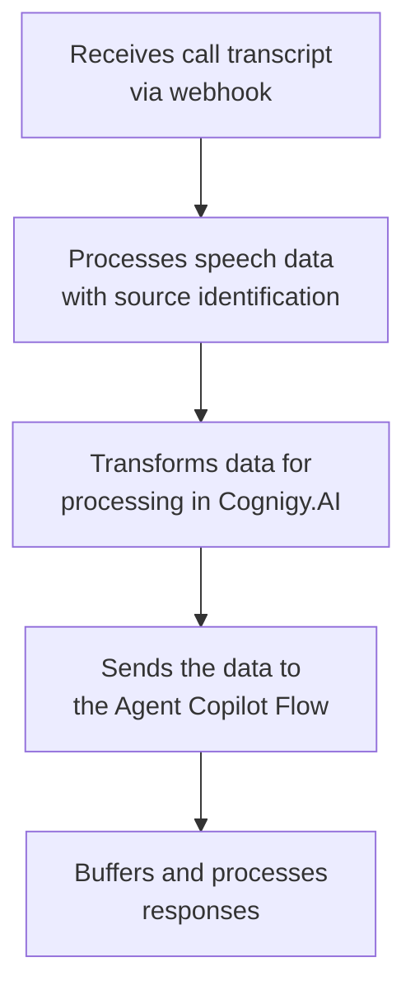

<a href="/release-notes/4.66"><Badge className="version-badge" color="blue">Updated in 4.66</Badge></a>

<Frame>
  
</Frame>

The Voice Copilot Endpoint handles transcripts from voice calls via webhooks, processes them in real time and sends them to [Agent Copilot](/agent-copilot/overview) Flows. After receiving a transcript, the Endpoint passes the `userId` and `sessionId` variables to Cognigy.AI to identify the Agent Copilot workspace to be updated.

The Voice Copilot Endpoint works with any [handover provider](/ai/escalate/handover-reference/overview) supported by Cognigy.AI. This Endpoint also supports integration with SIP recording (SIPREC). SIPREC is an open SIP-based protocol for call recording in contact centers. Session Border Controllers (SBC) integrate SIPREC with the contact center.

You can [configure](#configure-the-voice-copilot-endpoint) the Voice Copilot Endpoint in the following setups:

- Cognigy.AI in front of a contact center
- A SIPREC contact center integration in front of Voice Gateway## Generic Endpoint Settings

## Key Features

- Processes real-time speech transcripts.
- Manages user and session identification.
- Supports human agent and user tagging in channels.
- Implements output buffering for sequential message processing.
- Handles SIPREC INVITE requests for call setup.

## Prerequisites

- You have configured an [Agent Copilot Flow](/agent-copilot/configure/overview).

## Transcript Data Flow

The data flow shows how the Endpoint receives call transcripts, identifies the speaker, sends the data to Agent Copilot for processing, and then processes the responses to send back.



## Generic Endpoint Settings

Find out about the generic endpoint settings available with this endpoint on the following pages:

- [Endpoints Overview](/ai/agents/deploy/endpoints/overview)
- [Transformer Functions](/ai/for-developers/transformers/overview)

## Set up a Voice Copilot Endpoint

1. In **Deploy > Endpoints**, click **+ New Endpoint**.
2. In the **New Endpoint** section, configure the following:
    - **Endpoint Type** — select **Voice Copilot**.
    - **Name** — enter a unique name.
    - **Flow** — select a Flow from the list.
3. In the **Configuration Information** section, copy the Endpoint URL for later use in the Transfer Node if you use [Cognigy.AI in front](#configure-the-voice-copilot-endpoint) of your contact center.

## Configure the Voice Copilot Endpoint

<Tabs>
  <Tab title="Cognigy.AI in Front">

    Configure the Voice Copilot Endpoint in a Transfer Node:

    1. In **Build > Flows**, select a voice Flow from the list.
    2. In the Transfer Node, select the **Dial** transfer type.
        1. Activate the **Enable Copilot** setting.
        2. Enter the **Copilot Headers Key**. The key is provider-dependent. For example, for Genesys, the key is `User-to-User`. The generated value becomes accessible after engaging the Transfer Node, located in the Input object as `{{input.UUIValue}}`. You don't need to handle this value manually. It is automatically generated and added to the header.
        3. In the **Transcribe** section, enter the Voice Copilot Endpoint URL in the **Transcript Webhook** field. You need to copy this Endpoint URL from the **Endpoint URL** field in the Endpoint settings. For example, `https://endpoint.cognigy.ai/<your-endpoint-id>`. This setup ensures that the Voice Copilot Endpoint receives the transcript and the corresponding session and user IDs, ensuring the transcript is correctly matched with the Agent Copilot workspace.

  </Tab>
  <Tab title="SIPREC Contact Center Integration in Front">

    When a call is transferred to a human agent, [Voice Gateway](/voice-gateway/overview) transcribes the audio from a SIPREC call and sends it to the Voice Copilot Endpoint for processing. This approach replaces the [user ID and session ID](/ai/agents/analyze/user-and-session-identification) for contact center-specific identifiers, for example, agent ID and conversation ID.

    **Configure a SIPREC Contact Center Integration**

    On the SIPREC contact center side, configure the following:

    1. In the SIPREC call settings, set the Voice Gateway IP addresses as the target of the audio stream. You can find the Voice Gateway IP addresses in the Voice Gateway Self-Service Portal under [Carriers](/voice-gateway/webapp/carriers). Make sure you allow your carriers to send data to and receive data from Voice Gateway's SIP signaling IPs.
    2. In the SIP headers, you need to provide identifiers that match the identifiers of the Agent Copilot workspace. This approach ensures that the transcripts are correctly transferred from the SIPREC call to the Agent Copilot workspace. For example, if you use agent ID and conversation ID in the contact center, configure the SIP headers as follows:

    ```text
    X-Session-ID = {conversationId}
    X-User-ID = {agentId}
    ```

    **Configure a Voice Gateway Application**

    1. In the Voice Gateway Self-Service Portal, configure an [application](/voice-gateway/webapp/applications) to receive the call transcripts.
    2. In **Accounts**, select the account you want to use for SIPREC calls and select the application you've just configured in the **Application for SIPREC calls** list.

    **Configure Agent Copilot**

    To ensure that the [Agent Copilot workspace](/agent-copilot/overview) receives the transcripts from the SIPREC call, the identifiers of the Agent Copilot workspace URL and of the SIP headers must match. For example, if you use agent ID and conversation ID in the SIP headers, the Agent Copilot URL should be as follows:

    ```text
    ${AgentCopilotBaseUrl}/?userId=${agentId}&sessionId=${conversationId}&URLToken=${URLToken}
    ```
  </Tab>
</Tabs>

## More Information

- [Agent Copilot](/agent-copilot/overview)
- [Voice Gateway](/voice-gateway/overview)
