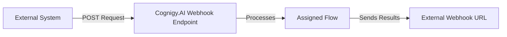

import ReleaseNotesHandoverProvidersDeprecation from '/snippets/release-notes/handover-providers-deprecation.mdx'
import ApiKeyAuthSettings from '/snippets/ai/deploy/endpoint/api-key-auth-settings.mdx'

<a href="/release-notes/2026.14"><Badge className="version-badge" color="blue">Updated in 2026.14</Badge></a>

<Frame>
  
</Frame>

<ReleaseNotesHandoverProvidersDeprecation/>

The Webhook Endpoint connects your AI Agent to external systems by sending real-time events, such as user or system messages, to a specified callback (webhook) URL. Additionally, you can configure API key-based authentication for requests to this Endpoint.

The Endpoint receives `POST` requests at the Cognigy.AI Endpoint URL, processes them with the assigned Flow, and sends results asynchronously to your webhook URL.



If you use [Agent Copilot for voice](/agent-copilot/getting-started/voice) with the Webhook Endpoint, you can switch to a specific [Voice Copilot](/ai/agents/deploy/endpoint-reference/voice-copilot) Endpoint. This Endpoint includes all webhook logic, so you don't need to use a Code Node.

## Prerequisites

- To receive `POST` requests from Cognigy.AI at your webhook URL, run a web server on your side.
- _(Optional)_ Set up basic authentication for your web server.

## Restrictions

- [Snapshots](/ai/agents/deploy/snapshots) and [Packages](/ai/platform-features/packages) don't support API keys generated in this Endpoint. If you export a Webhook Endpoint that includes an API key, generate a new API key in the target Project. Then update your code to include the new API key.

## Generic Endpoint Settings

Learn about the generic Endpoint settings on the following pages:

- [Endpoints Overview](/ai/agents/deploy/endpoints/overview)
- [NLU Connectors](/ai/platform-features/nlu/external/nlu-connectors/overview)
- [Data Protection & Analytics](/ai/agents/deploy/endpoints/data-protection-and-analytics)
- [Real-Time Translation Settings](/ai/agents/deploy/endpoints/real-time-translation-settings)
- [Handover Settings](/ai/agents/deploy/endpoints/handover-settings)
- [Inject and Notify](/ai/agents/deploy/endpoints/inject-and-notify)
- [Copilot](/agent-copilot/configure/copilot-section)

## Specific Endpoint Settings

<AccordionGroup>
<Accordion title="API Key Authentication">

  <ApiKeyAuthSettings headerName="X-Webhook-Key" />

</Accordion>
<Accordion title="Basic Auth Credentials">

  Use this section to provide the webhook URL and, optionally, credentials Cognigy.AI uses to authenticate outgoing requests to the webhook URL.

  | Parameter | Type | Description                                                                                                     |
  | --------- | ---- | --------------------------------------------------------------------------------------------------------------- |
  | User      | Text | This parameter is optional. Sets the username to authenticate against when sending requests to the webhook URL. |
  | Password  | Text | This parameter is optional. Sets the password to authenticate against when sending requests to the webhook URL. |
  | Webhook   | Text | Sets the webhook URL to send requests to.                                                                       |

</Accordion>
</AccordionGroup>

## How to Set Up

### Setup on the Cognigy.AI Side

<Accordion title="1. Create a Webhook Endpoint">
  1. In the left-side menu of your Project, go to **Deploy > Endpoints**, and click **+ New Endpoint**.
  2. In the **New Endpoint** section, do the following:
      1. Select the **Webhook** Endpoint type.
      2. Specify a unique name.
      3. Select a Flow from the list.
  3. _(Optional)_ To set up Endpoint-specific API authentication, select **API Key** from the **Authentication Method** list in the **API Key Authentication** section. The **Endpoint API Keys** section appears. Follow these steps:
      1. Click **+ Generate API Key**.
      2. In the dialog box, enter a unique name for your API key and click **Generate API Key**.
      3. Click the **Key** field to copy the generated API key for later use in the `X-Webhook-Key` header. Save the API key because you can't retrieve it after closing the dialog. Alternatively, you can create and manage API keys for this Endpoint using the `/v2.0/endpoints/{endpointId}/apikeys` routes via [Cognigy API](https://api-trial.cognigy.ai/openapi#tag--Endpoints).
  4. In the **Basic Auth Credentials** section, enter the external webhook URL in the **Webhook** field. This URL is where Cognigy.AI sends output data.
  5. _(Optional)_ If your webhook uses basic authentication, fill in the **User** and **Password** fields.
  6. Save changes and go to the **Configuration Information** section. For sending `POST` requests to the Cognigy.AI Webhook Endpoint, copy the URL from the **Endpoint URL** field.
</Accordion>

### Setup on the Third-Party Provider Side

<AccordionGroup>
  <Accordion title="1. Send a Request">

    Send a `POST` request to the Cognigy.AI Webhook Endpoint. Your web server must accept `POST` requests and process the JSON payload sent by Cognigy.AI. For testing purposes, you can use [webhook.site](https://webhook.site) as a temporary web server.

    <AccordionGroup>
      <Accordion title="No Authentication">

        <Tabs>
          <Tab title="cURL">
            Replace `https://<your-endpoint-url>` with the Endpoint URL from the Endpoint settings.

            ```bash
            curl -X POST https://<your-endpoint-url> \
              -H "Content-Type: application/json" \
              -d '{
                "userId": "user123",
                "sessionId": "session123",
                "text": "Hello, I need help with my order",
                "data": {
                  "exampleKey": "exampleValue"
                }
              }'
            ```
          </Tab>
          <Tab title="Postman">
            1. Open the Postman collection, select **Add a request**, then set the request type to `POST`.
            2. Enter the Endpoint URL as the request URL.
            3. Go to the **Headers** tab and add `Content-Type: application/json`.
            4. Go to the **Body** tab, select **raw**, then select **JSON** as the format.
            5. Paste the request body:

            ```json
            {
              "userId": "user123",
              "sessionId": "session123",
              "text": "Hello, I need help with my order",
              "data": {
                "exampleKey": "exampleValue"
              }
            }
            ```

            | Parameter | Type   | Description                                                                                                                                                                                                 | Required                                             |
            | --------- | ------ | ----------------------------------------------------------------------------------------------------------------------------------------------------------------------------------------------------------- | ---------------------------------------------------- |
            | userId    | String | The ID of the end user.                                                                                                                                                                                     | Yes                                                  |
            | sessionId | String | The ID used to track the current session and maintain its state. Generate a new unique ID for each new session. For testing, you can use any string and change it whenever you want to start a new session. | Yes                                                  |
            | text      | String | The text that the assigned Flow processes.                                                                                                                                                                  | No, if `data` is specified<sup>[1](#footnote1)</sup> |
            | data      | Object | The data that the assigned Flow processes.                                                                                                                                                                  | No, if `text` is specified<sup>[1](#footnote1)</sup> |
          </Tab>
        </Tabs>

      </Accordion>
      <Accordion title="With API Key Authentication">

        <Tabs>
          <Tab title="cURL">
            Replace `https://<your-endpoint-url>` with the Endpoint URL and `<your-api-key>` with an active API key from the Endpoint settings.

            ```bash
            curl -X POST https://<your-endpoint-url> \
              -H "Content-Type: application/json" \
              -H "X-Webhook-Key: <your-api-key>" \
              -d '{
                "userId": "user123",
                "sessionId": "session123",
                "text": "Hello, I need help with my order",
                "data": {
                  "exampleKey": "exampleValue"
                }
              }'
            ```
          </Tab>
          <Tab title="Postman">
            1. Open the Postman collection, select **Add a request**, then set the request type to `POST`.
            2. Enter the Endpoint URL as the request URL.
            3. Go to the **Headers** tab and configure:
                - `Content-Type` — select `application/json`
                - `X-Webhook-Key` — the API key you generated in the [API Key Authentication](#api-key-authentication) section.
            4. Go to the **Body** tab, select **raw**, then select **JSON** as the format.
            5. Paste the request body:

            ```json
            {
              "userId": "user123",
              "sessionId": "session123",
              "text": "Hello, I need help with my order",
              "data": {
                "exampleKey": "exampleValue"
              }
            }
            ```

            | Parameter | Type   | Description                                                                                                                                                                                                 | Required                                             |
            | --------- | ------ | ----------------------------------------------------------------------------------------------------------------------------------------------------------------------------------------------------------- | ---------------------------------------------------- |
            | userId    | String | The ID of the end user.                                                                                                                                                                                     | Yes                                                  |
            | sessionId | String | The ID used to track the current session and maintain its state. Generate a new unique ID for each new session. For testing, you can use any string and change it whenever you want to start a new session. | Yes                                                  |
            | text      | String | The text that the assigned Flow processes.                                                                                                                                                                  | No, if `data` is specified<sup>[1](#footnote1)</sup> |
            | data      | Object | The data that the assigned Flow processes.                                                                                                                                                                  | No, if `text` is specified<sup>[1](#footnote1)</sup> |
          </Tab>
        </Tabs>

      </Accordion>
    </AccordionGroup>

  </Accordion>

  <Accordion title="2. Get a Response">

    The Webhook Endpoint sends the following JSON response to your external system. This response contains information about the user, session, and the AI Agent output:

      ```JSON
      {
         "userId": "user123",
         "sessionId": "session123",
         "AIOutput": {
            "text": "I’d be happy to help. Could you please provide your order number?",
            "data": {},
            "traceId": "endpoint-httpIncomingMessage-83b52cb7-1452-4c2d-a57d-4a81e6adb92c",
            "disableSensitiveLogging": false,
            "source": "bot"
         }
      }
      ```

    | Parameter                 | Type    | Description                                                                                                                             |
    | ------------------------- | ------- | --------------------------------------------------------------------------------------------------------------------------------------- |
    | `userId`                  | String  | The ID of the user who sent the original request.                                                                                       |
    | `sessionId`               | String  | The session ID used to track the conversation context.                                                                                  |
    | `AIOutput.text`           | String  | The response message generated by the AI Agent.                                                                                         |
    | `AIOutput.data`           | Object  | The message data returned from the Flow.                                                                                                |
    | `AIOutput.traceId`        | String  | The ID used for tracing and debugging purposes.                                                                                         |
    | `AIOutput.source`         | String  | The message source. Always `"bot"` for AI Agent replies.                                                                                |
    | `disableSensitiveLogging` | Boolean | The flag indicating if logging is disabled. If the value is `true`, this interaction won't be logged for privacy or compliance reasons. |
  </Accordion>
</AccordionGroup>

---
<sup id="footnote1">1</sup>: You must provide at least one of `text` or `data`. You can send either, or both. If both are missing or invalid, the Webhook Endpoint throws an error.
