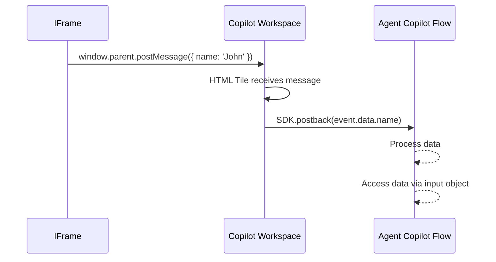

import AiNodesPostback from '/snippets/ai/nodes/postback.mdx'

<a href="/release-notes/4.90"><Badge className="version-badge" color="blue">Updated in 4.90</Badge></a>

<Frame>
  
</Frame>

## Description

This Node embeds external websites directly into the Agent Copilot workspace. To do that, specify a URL for the external content you want to display. You can present web pages, forms, or applications within the Agent Copilot workspace without redirecting human agents to an external site.

## Parameters

| Parameter  | Type          | Description                                              |
|------------|---------------|----------------------------------------------------------|
| Tile ID    | CognigyScript | The ID that you created in the Agent Copilot configuration. |
| IFrame URL | URL           | The URL to render inside the Widget.                     |
| JSON Data  | JSON          | The data to send to the iframe as a postMessage event.   |

## Passing JSON Data into the IFrame

When you use a Copilot: IFrame Tile Node, JSON data is passed into the iframe code using the [postMessage](https://developer.mozilla.org/en-US/docs/Web/API/Window/postMessage) method.

To receive and process the passed JSON in your widget, add an event listener inside the iframe content:

```js
window.addEventListener("message", function (event) {
  console.log("Content of message:", event.data);
  // Handle the incoming JSON data here
});
```

<Accordion title="Example: Dynamic IFrame Content">

```html
<!DOCTYPE html>
<html>
  <head>
    <title>IFrame Example</title>
  </head>
  <body>
    <script>
      let counter = 0;

      // Update the body content every second
      setInterval(function() {
        counter++;
        document.body.innerHTML = '<h1>iframe Tile ' + counter + '</h1>';
      }, 1000);

      // Listen for messages from the parent window
      window.addEventListener('message', function(event) {
        console.log('Content of message from parent:', event.data);
        // Process the received data here
      });
    </script>
    <h1>iframe Tile</h1>
  </body>
</html>
```

</Accordion>

At this stage, the iframe can get data from the Agent Copilot workspace. Next, you can set up the iframe to send data back to the Flow.

## Send Data from the IFrame Back to the Flow

User actions inside the iframe, such as form submissions or button clicks, can trigger logic in the Agent Copilot Flow.

To send data from an iframe back to the Agent Copilot Flow, use the browser messaging API method `window.parent.postMessage()`. The Agent Copilot workspace receives this message and forwards it to the Flow using `SDK.postback`.

<Note>
  Only the workspace can call `SDK.postback`. The iframe itself can't call it directly because it runs in an isolated context.
</Note>

<Accordion title="Send Data back to the Flow">

<Steps>
  <Step title="IFrame sends data">
    The iframe sends a JSON object as data to the Agent Copilot workspace via `window.parent.postMessage()`.

    ```html
    <button type="button" onclick="window.parent.postMessage({ name: 'John' }, '*')">Submit</button>
    ```
  </Step>

  <Step title="Workspace receives the message">
    The Agent Copilot workspace receives messages via an HTML tile controlled by the [Copilot: HTML Tile Node](/ai/agents/develop/node-reference/agent-copilot/set-html-tile), which listens for messages from the iframe.
    The HTML Tile tile doesn't need to be visible, but it must exist in the workspace.

    In this example:

    - `window.parent.addEventListener` ensures the message is caught from the parent workspace.
    - Only data with the `name` property is sent to the Flow.
    - `SDK.postback` automatically wraps the data into the `_agentAssist` payload for the Flow.

    ```html
    <script>
    window.parent.addEventListener("message", function (event) {
      console.log("Content of parent message:", event.data);
      if (event.data.name) {
        SDK.postback(event.data.name);
      }
    });
    </script>
    ```

  </Step>

  <Step title="HTML Tile forwards data to the Flow">
    The HTML Tile forwards the received data to the Agent Copilot Flow using `SDK.postback`.
  </Step>

  <Step title="Flow receives the message">
   The Flow receives the message payload in this JSON structure:

    ```json
    {
      "data": {
        "_cognigy": {
          "_agentAssist": {
            "type": "submit",
            "payload": { "name": "John" }
          }
        }
      }
    }
    ```
  </Step>

  <Step title="Accessing data in the Flow">
    You can access the data received from the iframe in the Flow via the Input object.

    In the Agent Copilot Flow, add a Say Node and reference the payload using the following syntax:

    ```txt
    {{ input.data._cognigy._agentAssist.payload.name }}
    ```

    This output is visible only to human agents in the Copilot workspace.
  </Step>
</Steps>

The sequence diagram illustrates how the data is sent from the iframe to the Flow via the workspace:


</Accordion>


<Accordion title="Example: Name Submission from an IFrame">

```html
<input id="name" type="text" placeholder="Enter your name" />
<p id="message"></p>
<button type="button" onclick="
    const name = document.getElementById('name').value;
    if (name) {
      window.parent.postMessage({ name }, '*');
    } else {
      document.getElementById('message').innerText = 'Please enter your name.';
    }
  ">
  Submit
</button>
```

</Accordion>

## More Information

- [Copilot: HTML Tile](/ai/agents/develop/node-reference/agent-copilot/set-html-tile)
- [Copilot: Adaptive Card Tile](/ai/agents/develop/node-reference/agent-copilot/set-adaptive-card-tile)
- [Copilot: Send Data](/ai/agents/develop/node-reference/agent-copilot/send-data)
- [Copilot: Set Grid](/ai/agents/develop/node-reference/agent-copilot/set-grid)
- [Copilot Nodes](/ai/agents/develop/node-reference/agent-copilot/overview)
- [Copilot](/agent-copilot/overview)
