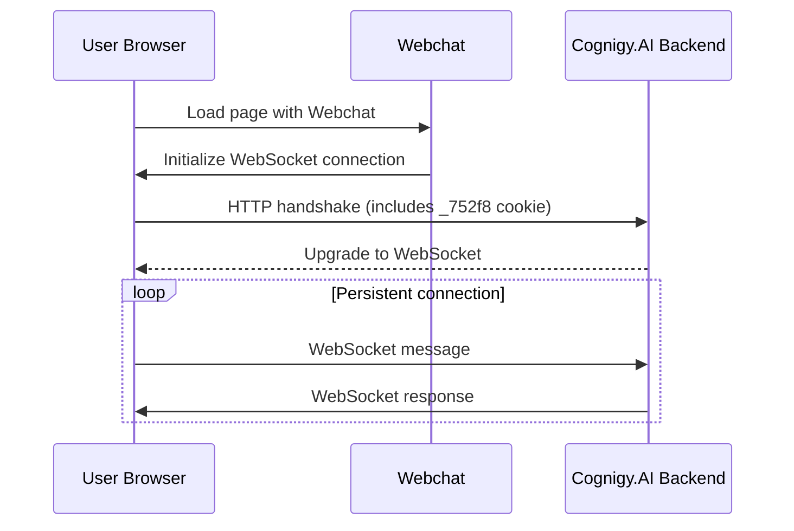

This article explains how Cognigy Webchat uses cookies, when each cookie is set, and how to manage cookie behavior through configuration.

## Prerequisites

- Webchat is embedded on your website or application.
- Basic familiarity with HTTP cookies and general web connectivity concepts.

## Concepts

Webchat uses [WebSockets](https://websockets.spec.whatwg.org/) to create a persistent connection between the user's browser and the Cognigy.AI backend.
This connection stays open, allowing the browser and backend to exchange messages in real time without sending repeated HTTP requests.

### Cookie Types

The table summarizes the cookies used by Webchat, including their purpose, lifetime, and suggested wording for your cookie policy.

<Note>
  These cookies don't perform cross‑site tracking, analytics, or profiling.
</Note>

| **Cookie Name**                       | **Description**                                                                                        | **Lifetime**                                | **Policy Wording Suggestion**                               |
| ------------------------------------- | ------------------------------------------------------------------------------------------------------ | ------------------------------------------- | ----------------------------------------------------------- |
| `_752f8` (Mandatory Session Cookie)   | Always required for routing Webchat messages to the Cognigy.AI backend instance.                       | Expires at the end of the browsing session. |  Preserves visitor sessions for AI‑driven customer support. |
| `IO` (Transport Compatibility Cookie) | Used in older Webchat versions that supported HTTP Polling. This cookie is no longer used.             | -                                           | -                                                           |

### Connection Mode

Webchat uses WebSockets as its only connection mode. The diagram shows how the connection is established and how the session cookie is used during the process.

When a user opens Webchat, the browser first performs an HTTP handshake to initiate the WebSocket connection. During this handshake, the browser automatically includes the session cookie (`_752f8`). The backend uses this cookie to identify and route the session. After the connection is successfully upgraded, messages are exchanged over the persistent WebSocket connection without additional HTTP requests.

## Use Cases

- **Standard operation.** Webchat runs exclusively over WebSockets. This behavior is the default required setup for all deployments.
- **Privacy-aware deployment.** Only one session cookie is used. The privacy-aware deployment doesn't use tracking, analytics, or cross-site cookies. This approach simplifies compliance requirements and reduces the overall cookie footprint.

## How to Use Webchat Cookies

The following steps outline how to configure and test Webchat's connection and cookie behavior:

1. Embed the Webchat in your site with the [standard documentation steps](/webchat/v3/embedding/hosted-script).
2. In the [Webchat embedding configuration](/webchat/v3/embedding#configuration-options), use the `disableWebsockets` and `forceWebsockets` options to control WebSocket behavior.

   | **disableWebsockets** | **forceWebsockets** | **Result**                              | **Cookies Set** |
   | --------------------- | ------------------- | --------------------------------------- | --------------- |
   | `false`               | `true`              | WebSockets                              | `_752f8`        |
   | `false`               | `false`             | WebSockets (default)                    | `_752f8`        |
   | `true`                | any                 | Not supported                           | —               |

3. Test the connection across different browsers and network environments to ensure WebSockets are allowed.
4. Add information about Webchat cookies to your website's privacy or cookie policy.
5. Review your consent banner to ensure users are informed that Webchat requires a mandatory session cookie.

## More Information

- [Client-Side Configuration: Webchat Options](https://github.com/Cognigy/Webchat/blob/main/docs/embedding.md#webchat-options)
- [Webchat v3: Embedding](/webchat/v3/embedding/hosted-script)
- [Webchat v2: Embedding](/webchat/v2/embedding)